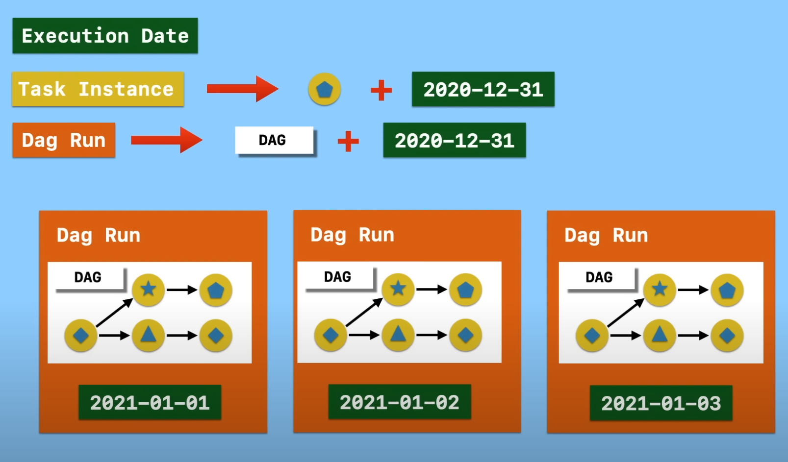
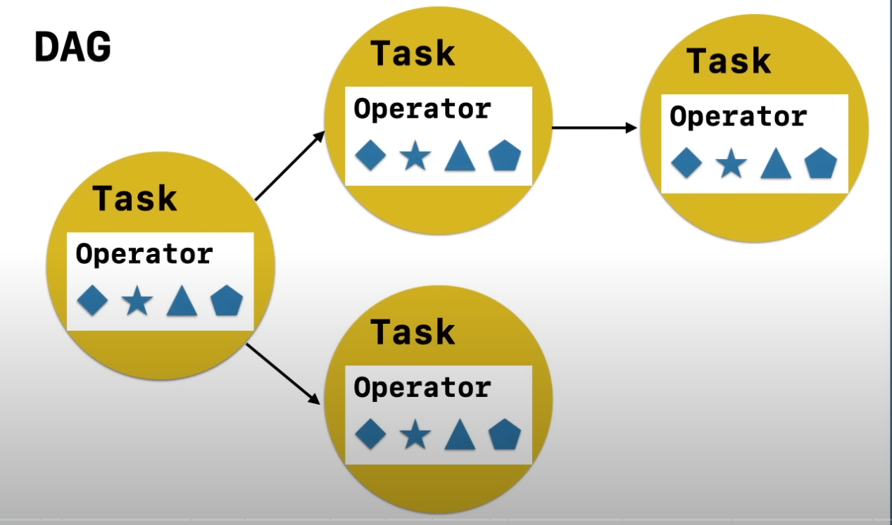

# Airflow tutorial
Tutorial airflow
timeline: 17:00

- Airflow starts in 2014 bij airbnb from beginning an opensource project
- Purpose: manage complex workflows
- Top-level Apache project in 2019
- One of the most popular workflow management platforms
- Written in [Python ](https://www.python.org/)

Workflow is a sequence of tasks

In Airflow workflow is defined as [DAG (Directed Acyclic Graph)](https://airflow.apache.org/docs/apache-airflow/stable/core-concepts/dags.html)

DAG is a way to define relations and dependencies between tasks.

Task is a unit of work in a DAG and is written in python

Operators define what is actually done in a task. Examples of operators:
- BashOperator
- PythonOperator
- ...
- Customised Operator

Each task is an implementation of an operator. 

- Execution Date is the logic date and time which the *DAG Run* and *Task Instance* are running for
- Task Instance run of a task at a specific date/time the execution date
- DAG Run is an instantiation of a DAG containing Task Instances that run for specific execution date

## Index
- [airflow tutorial](tut-01/README.md)
- [airflow docker](tut-02/README.md)

## References
- course https://www.youtube.com/watch?v=K9AnJ9_ZAXE&list=PLwFJcsJ61oujAqYpMp1kdUBcPG0sE0QMT
- course repository https://github.com/coder2j/airflow-docker 
- airflow https://airflow.apache.org/docs/apache-airflow/stable/start.html
- airflow github repository https://github.com/apache/airflow
  
